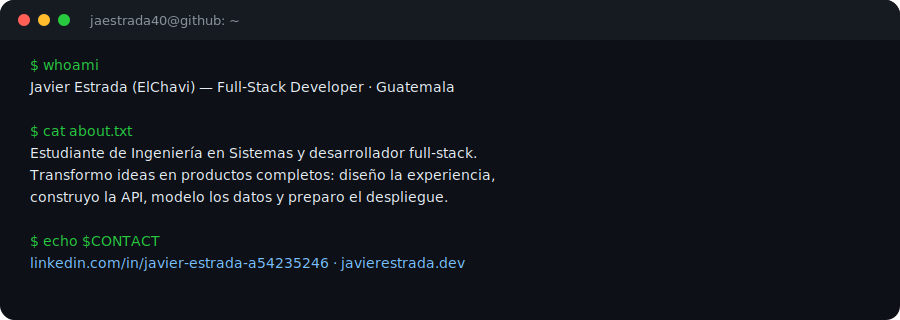

<h1 align="center">
  
</h1>

  
  
  
  

  

## Sobre mí

Estudiante de Ingeniería en Sistemas y desarrollador full-stack. Diseño la experiencia, construyo la API, modelo los datos y preparo el despliegue: el ciclo completo, de principio a fin.

He construido sistemas de producción para clínicas, universidades, entidades de gobierno y negocios comerciales — desde autenticación por roles y auditoría, hasta paneles en tiempo real, facturación electrónica e integraciones de pago. Me interesa el software claro, mantenible y útil para las personas que lo usan todos los días.

## Stack tecnológico

<table>
<tr>
<td valign="top" width="50%">

**Frontend**

**Backend**

</td>
<td valign="top" width="50%">

**Datos**

**Infraestructura**

</td>
</tr>
</table>

## Proyectos destacados

<table>
<tr>
<td width="50%" valign="top">

**[CompilaLab](https://compiladores.kynova.tech)**

Plataforma educativa interactiva para comprender el proceso de compilación: 21 semanas de contenido, laboratorios de tokenizador, expresiones regulares, autómatas (AFN/AFD), gramáticas, parser/AST, tabla de símbolos y generación de código intermedio.

`Next.js` `TypeScript` `Docker` `Coolify`

[🔗 Ver demo](https://compiladores.kynova.tech) · [📦 Código](https://github.com/jaestrada40/compiladores)

</td>
<td width="50%" valign="top">

**[javierestrada.dev](https://javierestrada.dev)**

Sitio personal con panel de administración propio: perfil, categorías y skills editables sin tocar código. Auto-deploy con webhooks de GitHub y certificado TLS automático.

`Angular` `NestJS` `Prisma` `PostgreSQL` `Docker`

[🔗 Ver sitio](https://javierestrada.dev) · [📦 Código](https://github.com/jaestrada40/javierestrada-dev)

</td>
</tr>
</table>

## Experiencia construyendo soluciones

**Sistemas clínicos** — historial de pacientes, agenda con detección de choques en tiempo real, consultas (SOAP, CIE-10), recetas, facturación electrónica (FEL) e inventario de medicamentos. Arquitectura cliente-servidor en LAN con Electron + NestJS + Socket.IO + PostgreSQL, respaldo/restauración y licenciamiento firmado.

**Sistemas universitarios** — gestión académica, solicitudes de documentos y kardex en PDF, autenticación por roles con JWT.

**Sistemas fiscales y gubernamentales** — portales de estadísticas públicas, gestión de acuerdos y procesos de contratación.

**SaaS comercial** — punto de venta para restaurantes con mesas, delivery, proveedores, fidelización, cupones, panel super-admin e insights con IA; sistemas de licenciamiento y créditos.

**Monitoreo en tiempo real** — motores de monitoreo con backend real (Postgres + Express), reemplazando almacenamiento local por datos persistentes.

**APIs y seguridad** — autenticación JWT con roles, auditoría de acciones sensibles, WebSockets autenticados, despliegues reproducibles con Docker.

## Estadísticas

  
  
  

  

<i>Siempre aprendiendo, construyendo y mejorando.</i>

